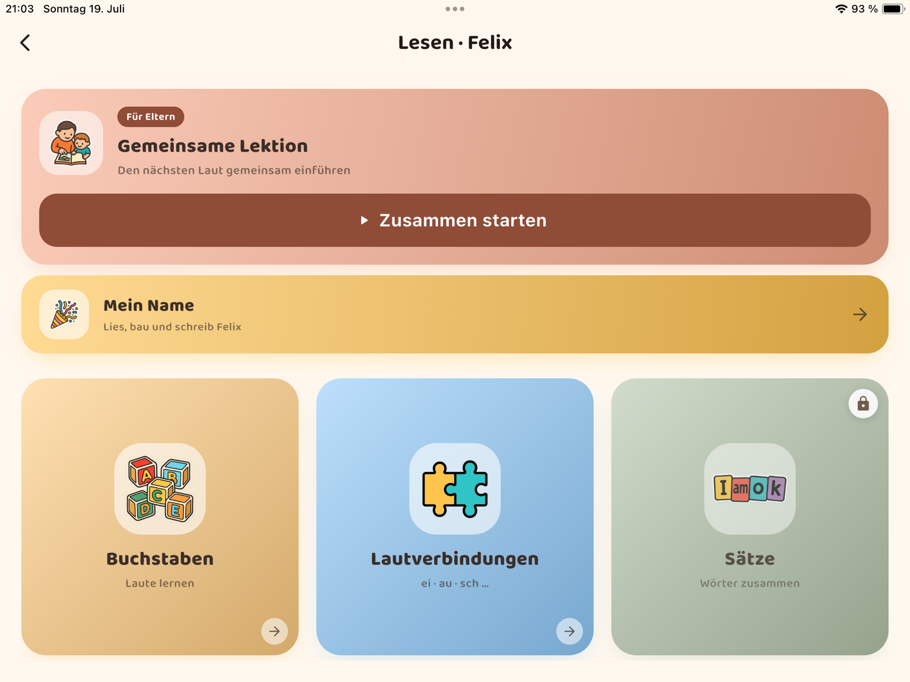

# Lernwichtel – Landingpage

Statische Ein-Seiten-Website für die App. Reines HTML/CSS/JS, keine Build-Tools,
keine externen Abhängigkeiten (alles inline bzw. lokal unter `assets/`).

## Struktur

```
website/
├── index.html            # Startseite (Styles + Markup inline)
├── datenschutz.html      # Datenschutzerklärung (für Play-/App-Store-Link)
└── assets/
    ├── lernwichtel.png    # Wichtel-Illustration (App-Icon, transparent) – Hero + Nav
    └── favicon.png        # Browser-Tab-Icon
```

Die **Datenschutz-URL** (z. B. `https://…/datenschutz.html`) im Play Store und in
App Store Connect als Datenschutzerklärung hinterlegen.

## Lokal ansehen

Einfach `index.html` im Browser öffnen:

```bash
open website/index.html          # macOS
```

Oder mit lokalem Server (empfohlen, damit relative Pfade sauber laufen):

```bash
cd website && python3 -m http.server 8000
# dann http://localhost:8000 aufrufen
```

## Screenshot einsetzen

Im Abschnitt „Ein Blick hinein" gibt es im Tablet-Rahmen einen Platzhalter
(`<div class="slot">`). So wird daraus der echte Screenshot:

1. Bild als `website/assets/screenshot.png` ablegen.
2. In `index.html` den `<div class="slot">…</div>` ersetzen durch:
   ```html
   
   ```

## Vor dem Veröffentlichen anpassen

- **Impressum** (Footer): die gelb markierten Platzhalter (Straße, PLZ/Ort,
  Name, ggf. USt-ID) ausfüllen.
- **Links**: GitHub-URL (`github.com/VonRehbergConsulting/lernwichtel-app`),
  Google-Play-ID und App-Store-Link auf die echten Ziele setzen.

## Deployment (z. B. GitHub Pages)

- Repo-Einstellungen → Pages → Quelle auf den Ordner `website/` (bzw. Inhalt
  nach `/docs` oder in einen `gh-pages`-Branch kopieren), oder
- Ordner direkt zu Netlify/Cloudflare Pages ziehen – es ist eine reine
  statische Seite ohne Build-Schritt.
